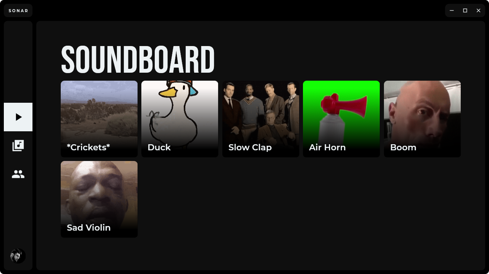
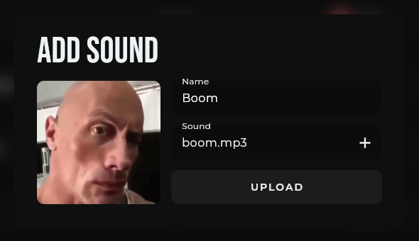
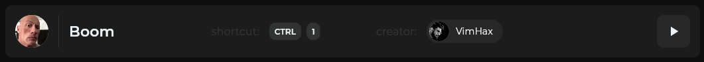
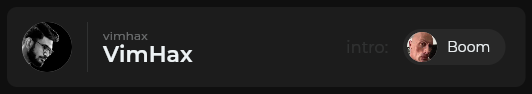
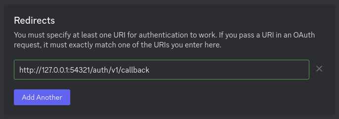
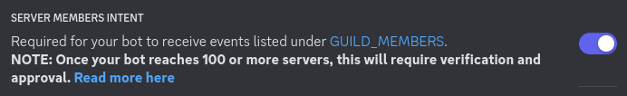

# Sonar



Upload sound effects to your heart's content and play them at will at the press of a button on your Discord Server.

## Features

- Upload sounds with names and thumbnail images (which can be GIFs) which can then later be edited or deleted.\

- Set global keyboard shortcuts to sounds so that you can trigger them while playing a game, for example. On Windows these keyboard shortcuts are non-blocking meaning that you can assign a shortcut which would otherwise conflict with a shortcut in the game.\
  
  > My friends had the idea to assign a sound effect to the letter `Q` so that when we trigger our ultimate abilities in [Overwatch](https://overwatch.blizzard.com/) it would play a funny sound effect.
- Assign sounds as intro sounds for members. When a member joins any voice channel Sonar would join and play their assigned intro sound.\
  
- Sounds can overlap, so you can play any sound at any time and know that it will be played together with any other ongoing sound.
- You can see who is playing what sound effect so you know who interrupted you.\
  
- Users login with their Discord account allowing for a smooth onboarding experience. This allows Sonar to only allow access to users who are members of a configured Discord Server so that only your friends can annoy you. 

## Platforms (Desktop Application)

- Windows
- MacOS*
- Linux**

*Not tested but should work for the most part.\
**Global shortcuts are blocking and [requires some extra configuration for custom schemes](#not-using-windows).

## Components

- [Desktop Application - `/app`](app/)
- [Discord Bot - `/discord-bot`](discord-bot/)
- [Redirect Website - `/redirect`](redirect/)
- [Supabase - `/supabase`](supabase/)

## Installation

A production-ready deployment for Sonar can be quite flexible, therefore the steps below will mainly provide the requirements and instructions for deploying Sonar locally. Adapt the following as you please to fit your needs.

### Requirements

**Items marked `Optional` are not necessary if you wish to host the components with Docker containers.**

- [Git](https://git-scm.com/downloads)
- [Docker](https://docs.docker.com/get-docker/)
- [Node.js (Optional)](https://nodejs.org/en/download)
- [Flutter](https://docs.flutter.dev/get-started/install)
- [Supabase CLI](https://supabase.com/docs/guides/cli/getting-started)

There may be platform specific dependencies which you may have to install to build the following Flutter packages to build and run the Sonar desktop application.

- [`audioplayers`](https://github.com/bluefireteam/audioplayers/blob/main/getting_started.md#setup-platforms)
- [`hotkey_manager`](https://pub.dev/packages/hotkey_manager#installation)
- [`@discordjs/voice` (For the Discord Bot, Optional)](https://discordjs.guide/voice/#installation)\
  The recommended dependencies ([`@discordjs/opus`](https://www.npmjs.com/package/@discordjs/opus) and [`sodium`](https://www.npmjs.com/package/sodium)) have been installed however you may swap these out for any other supported package.

### Discord Application

A Discord Application is necessary for user authentication through OAuth2 and playing sound effects on your Discord Server. Sonar is currently meant to only work on one Discord Server per instance so be sure to pick a Discord Server and have its ID ready.

> #### Don't have a Discord Application?
> You can follow [this](https://discordjs.guide/preparations/setting-up-a-bot-application.html#creating-your-bot) guide to create your Discord Application.

#### OAuth2 (Redirects)

For Supabase to be able to handle user authentication through Discord OAuth2 (which is required for Sonar) you need to add the appropriate redirect URI. You can learn more about OAuth2 with Discord for Supabase [here](https://supabase.com/docs/guides/auth/social-login/auth-discord).

> #### Deploying locally?
> \
> For a local deployment `http://127.0.0.1:54321/auth/v1/callback` may be a suitable URI.

#### Bot (Gateway Intents)



For Sonar to be able to play sound effects you need to enable the `Server Members Intent`. Be sure to invite the bot to your Discord Server and give it the necessary permissions to join and play sound.
### Instructions

#### 1. Clone the Repository

```sh
$ git clone https://github.com/VimHax/Sonar.git
```

#### 2. Set Environmental Variables

There are 3 components you need to set the environment variables for.

- Desktop Application - [`/app/example.env`](/app/example.env)
- Discord Bot - [`/discord-bot/example.env`](/discord-bot/example.env)
- Supabase - [`/example.env`](/example.env)

These `example.env` files contain all the environmental variables which need to be set to run each component. You may either set the environmental variables through external methods or, for a local deployment, you may simply copy the appropriate `example.env` file, rename it to `.env` and set all your values there.

**For the following instructions it is assumed you set all your environmental variables in `.env` files.**

| Name                                       | Description                                                                                                 |
|--------------------------------------------|-------------------------------------------------------------------------------------------------------------|
| `SUPABASE_AUTH_EXTERNAL_DISCORD_CLIENT_ID` | The client ID of your Discord Application.                                                                  |
| `SUPABASE_AUTH_EXTERNAL_DISCORD_SECRET`    | The client secret of your Discord Application.                                                              |
| `SUPABASE_AUTH_REDIRECT_URL`               | The URL to redirect users to after the Discord OAuth2 page.                                                 |
| `SUPABASE_URL`                             | The base Supabase API URL.                                                                                  |
| `SUPABASE_ANON_KEY`                        | The [anonymous API key](https://supabase.com/docs/guides/api/api-keys#the-anon-key) for Supabase.           |
| `SUPABASE_SERVICE_ROLE_KEY`                | The [service role API key](https://supabase.com/docs/guides/api/api-keys#the-servicerole-key) for Supabase. |
| `LOGIN_REDIRECT_URL`                       | Same as `SUPABASE_AUTH_REDIRECT_URL`.                                                                       |
| `DISCORD_BOT_TOKEN`                        | The bot token of your Discord Application.                                                                  |
| `GUILD_ID`                                 | The ID of the Discord server you wish to run Sonar on.                                                      |

#### 2. Setup Supabase

Start up Supabase locally.

```sh
$ supabase start
$ supabase functions serve
```

If your Supabase instance isn't new run the following command to reset the DB.

```sh
$ supabase db reset
```

> For my instance I use the hosted version of [Supabase](https://supabase.com/). You can learn more [here](https://supabase.com/docs/guides/cli/local-development).

#### 2. Run the Discord Bot

Build and run the Discord bot.

```sh
# Run in /discord-bot/
$ docker build --tag sonar-discord-bot .
$ docker run --network host --env-file .env sonar-discord-bot
```

> #### Have Node.js?
> You can execute the following instead to run the bot.
> ```sh
> # Run in /discord-bot/
> $ npm i
> $ npm run build
> $ npm start
> ```

The initial logs should look like the following.

```
[Event:Ready] Logged in as <name of your bot>!
[Event:Ready] Updated DB!
[Channel:soundboard] State: SUBSCRIBED
[Event:Ready] Added sounds!
[Event:Ready] Added intros!
[Channel:table-db-changes] State: SUBSCRIBED
```

#### 3. Host the Redirect Website

Build and host the redirect website.

```sh
# Run in /redirect/
$ docker build --tag sonar-redirect .
$ docker run -p 3000:80 sonar-redirect
```

> #### Have Node.js?
> You can execute the following instead to host the website.
> ```sh
> # Run in /redirect/
> $ npx serve
> ```

#### 4. Run the Desktop Application

Run the desktop application. Pick desktop if multiple platforms are available.

```sh
# Run in /app/
$ flutter run --dart-define-from-file='.env'
```

You should now be able to login through your Discord account and use all the functionality of Sonar locally.

> #### Not using Windows?
> On Windows the application registers a custom scheme at startup however this currently isn't the case for the other platforms, therefore you may have trouble logging in with the browser. For Linux [this](https://unix.stackexchange.com/questions/497146/create-a-custom-url-protocol-handler) post may be helpful to setup the scheme. (For Sonar the scheme is `com.vimhax.sonar`, eg: `com.vimhax.sonar://login-callback`) The desktop entry below (added to `~/.local/share/applications`) got me through development on Linux.
> ```
> #!/usr/bin/env xdg-open
> 
> [Desktop Entry]
> Version=1.0
> Terminal=false
> Type=Application
> Name=Sonar
> MimeType=x-scheme-handler/com.vimhax.sonar
> Exec=<path to Sonar repo>/app/build/linux/x64/debug/bundle/app %u
> ```
