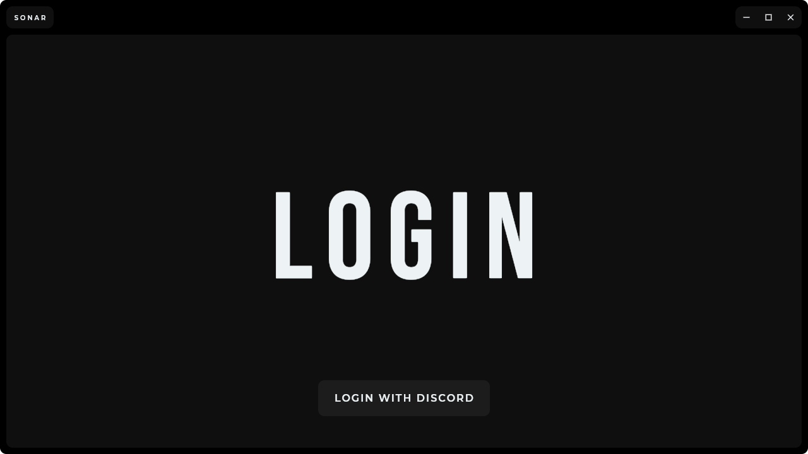
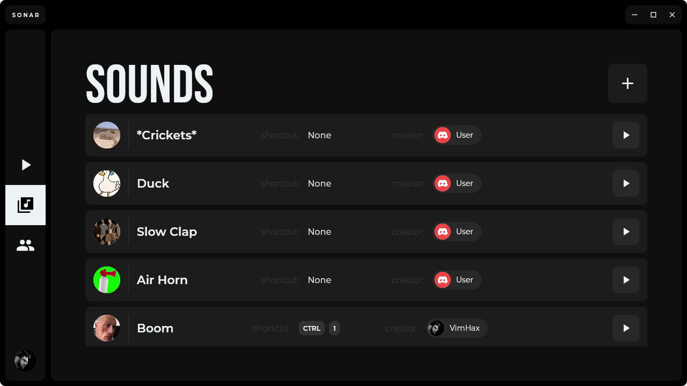
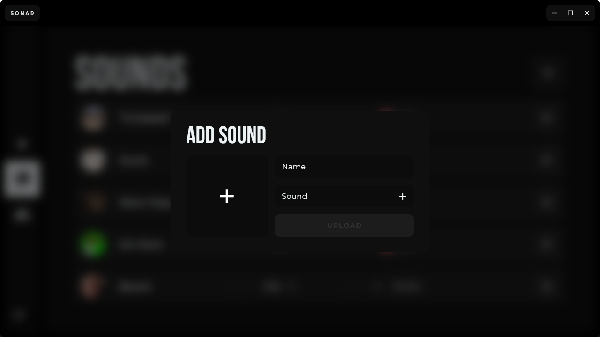
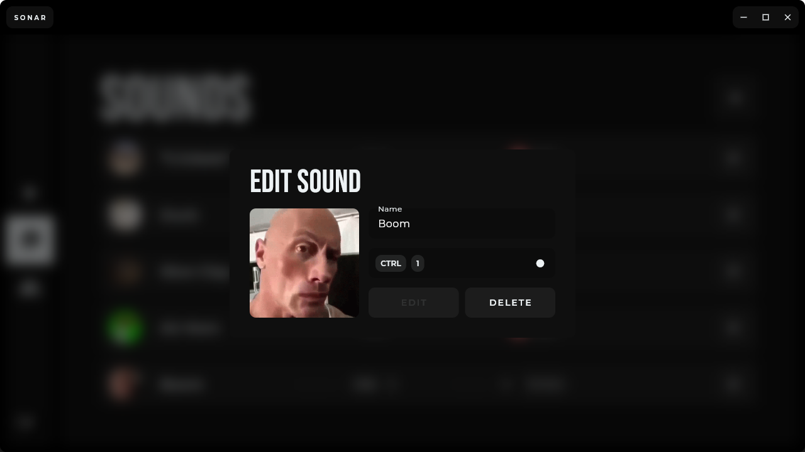
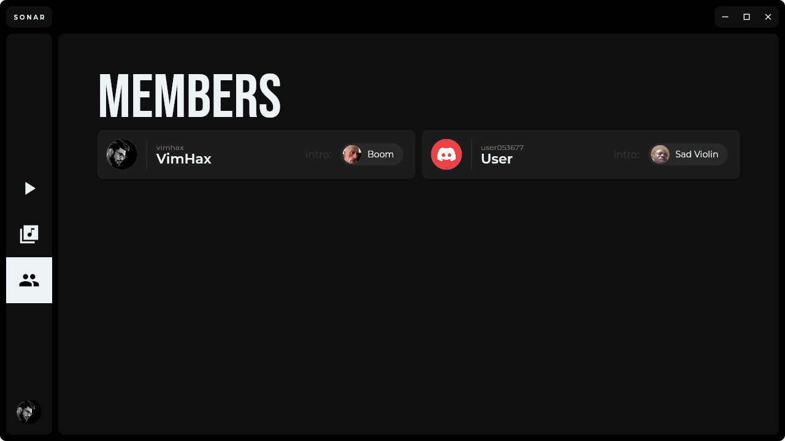
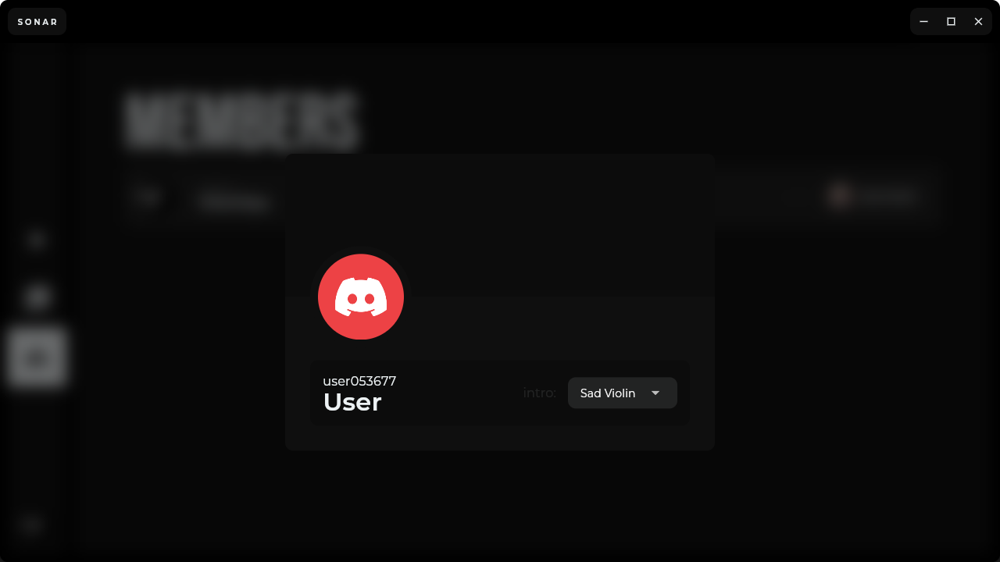

# Desktop Application

The desktop application for Sonar built using [Flutter](https://flutter.dev/). Thanks to [Supabase Realtime](https://supabase.com/docs/guides/realtime) everything that can be seen throughout the app is live, meaning any edits done will show up in realtime without having to refresh the page for example. (This goes for the members as well, if a user updates their avatar in Discord the change will show up in realtime on the desktop app.)

## Gallery

### Initial Page

The first page you see when you open Sonar.

### Login Page

Takes you through the Discord OAuth2 system in the browser to login to Sonar.

### Soundboard Page

Users can click on a sound tile to play it through the bot. Users can also see whoever else is playing sounds at that time with an indicator inside the tile of the sound being played.

### Sounds Page

Add, preview, edit or remove sounds.

> To remove a keyboard shortcut open the `Edit Sound` prompt, press record and press `ESC` on your keyboard.

### Members Page

See all non-bot members on the Discord Server and add or remove intro sounds from them.

