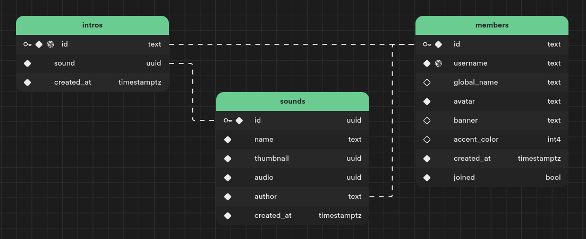

# Supabase Config

The [Supabase](https://supabase.com/) configuration for Sonar.

## Authentication

Discord is the only enabled provider to ensure that all users have a Discord user ID associated with them which Sonar can use to identify the membership of the user to the assigned Discord Server.

## Database

All 3 tables have Realtime enabled.

## Storage

2 buckets, `audio` and `thumbnail`, are created which store the audio files and thumbnails for the sounds respectively. Both these buckets are set to public and their mime types are set to `audio/*` and `image/*` respectively. Files are stored as `/<MemberID>/<FileID>` where the member ID is of the member who originally created the sound.

## Edge Functions

3 edge functions, `add-sound`, `edit-sound` and `delete-sound`, are deployed which manage the sounds.
